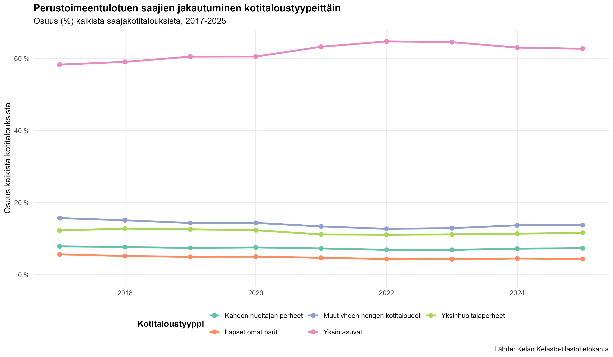
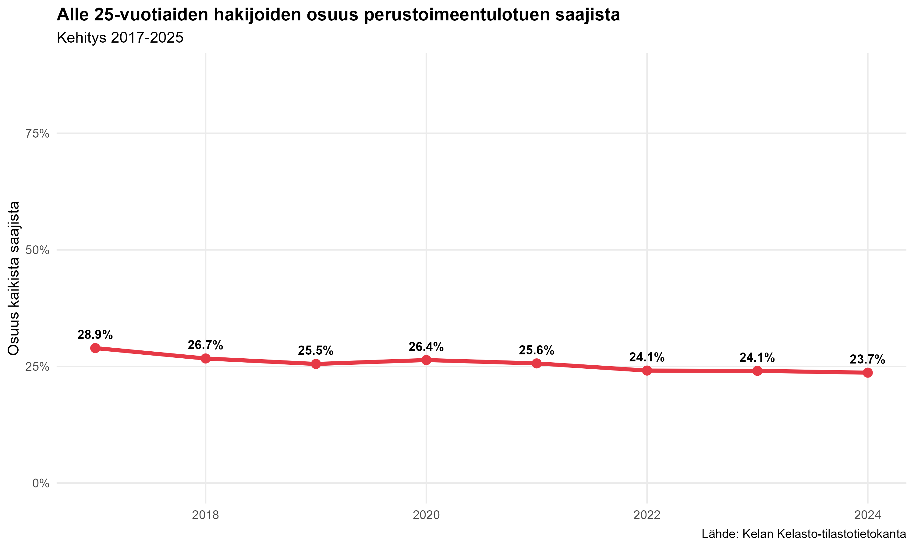
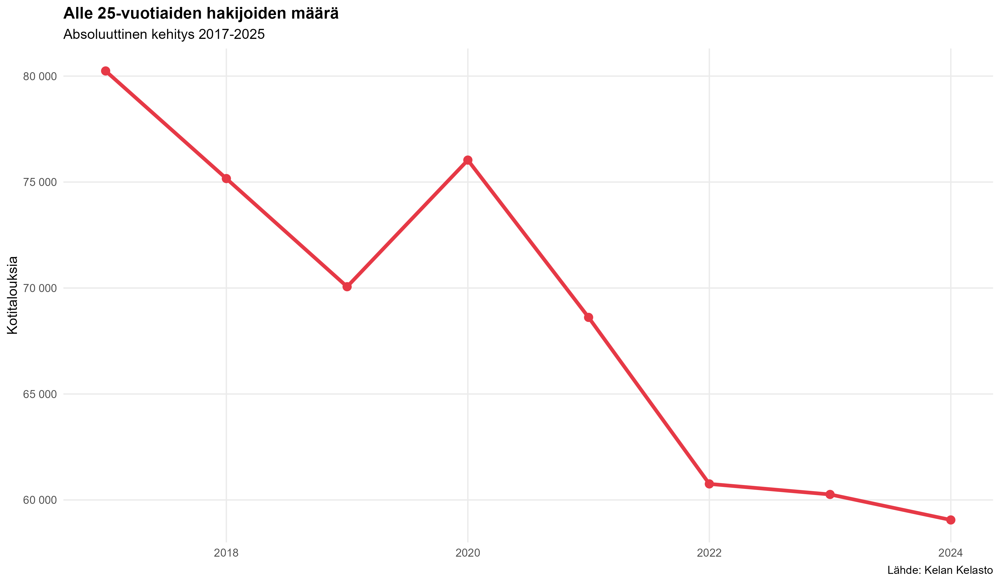
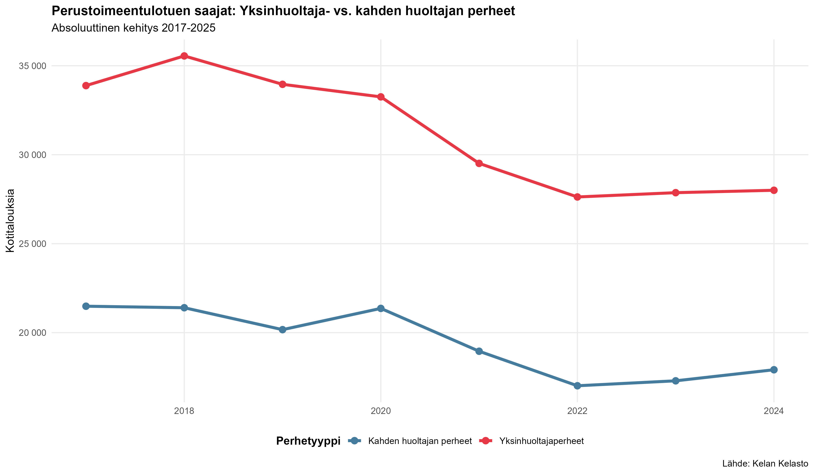
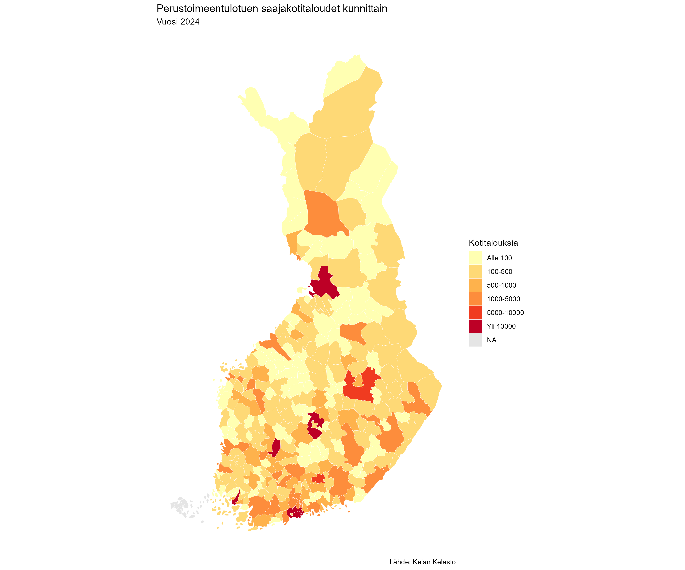
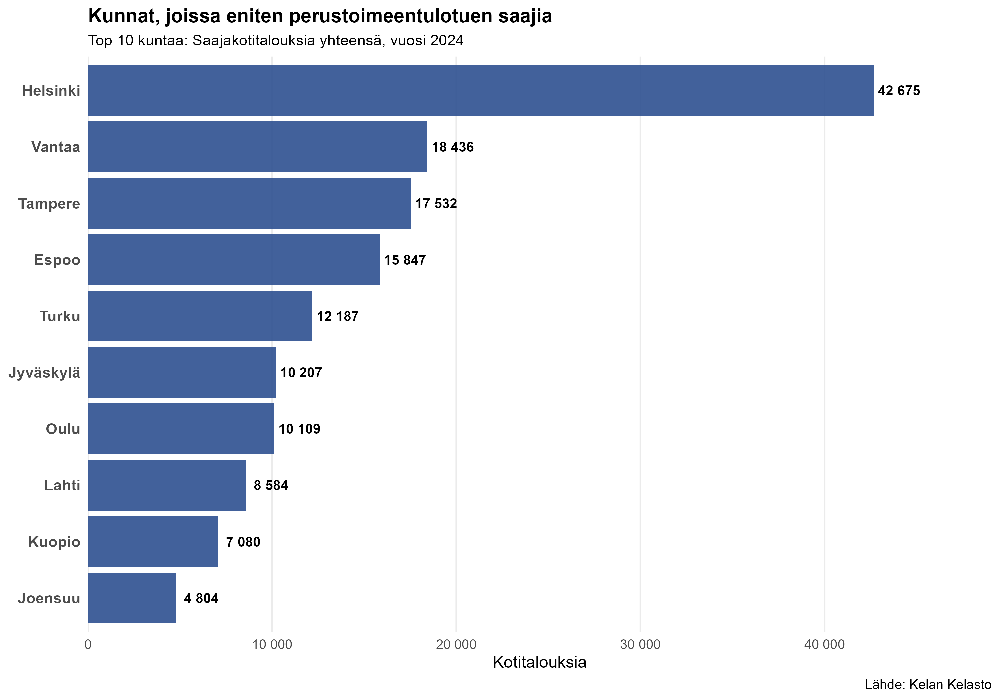
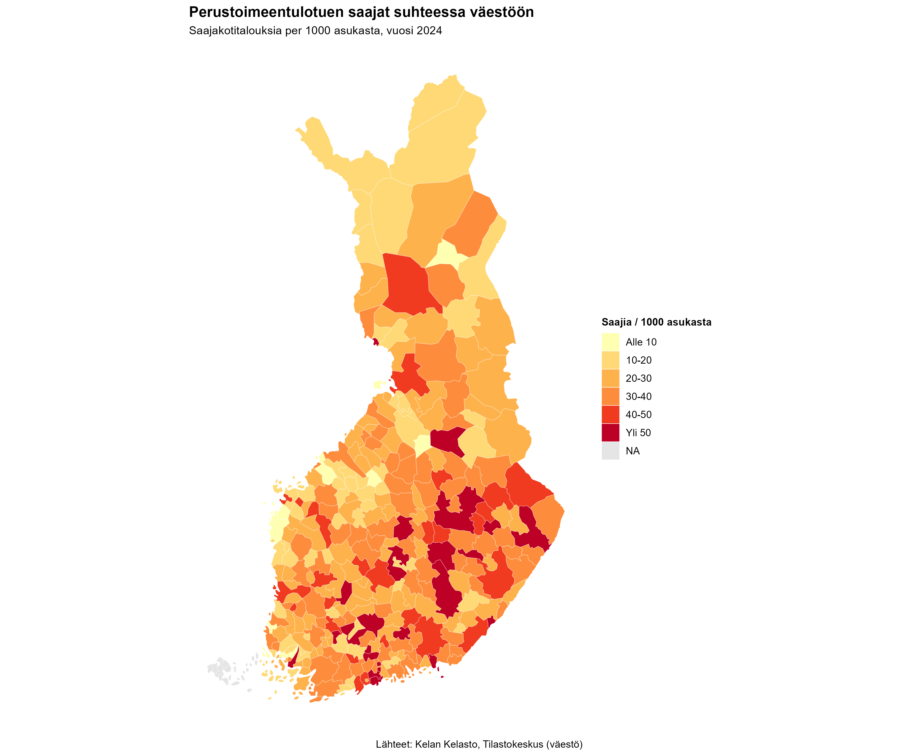
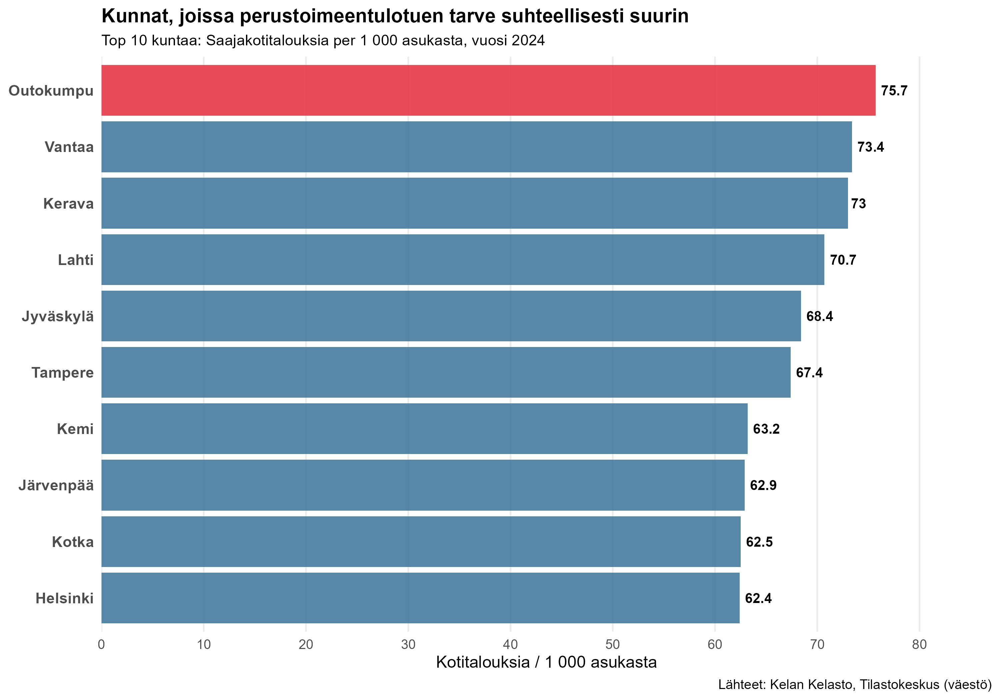

# Perustoimeentulotukea saavien kotitalouksien analyysi

Data-analyysi Kelan perustoimeentulotuen saajakotitalouksista vuosilta 2017-2025.

## 📊 Projektin tavoite

Tämä projekti analysoi perustoimeentulotuen saajakotitalouksien kehitystä Suomessa. Analyysi keskittyy:

- Kotitaloustyyppien osuuksien kehitykseen
- Alle 25-vuotiaiden hakijoiden tilanteeseen
- Yksinhuoltajaperheiden haavoittuvuuteen
- Alueellisiin eroihin

## 🔍 Keskeiset löydökset

### 1. Kotitaloustyyppien kehitys
- **Yksin asuvien osuus kasvoi COVID-19 pandemiasta lähtien** (2020→)
- Osuus ei ole palannut pre-COVID tasolle
- Muut kotitaloustyypit pysyneet vakaina

### 2. Nuorten tilanne parantunut merkittävästi
- Alle 25-vuotiaiden hakijoiden määrä **laskenut yli 20,000 kotitaloudella**
- Osuus kaikista saajista laskenut noin **5 prosenttiyksikköä**
- Sekä absoluuttinen määrä että suhteellinen osuus laskussa
- **Positiivinen yhteiskunnallinen kehityssuunta**

### 3. Yksinhuoltajaperheet haavoittuvampia
- Yksinhuoltajaperheitä noin **10,000 enemmän** toimeentulotuella kuin kahden huoltajan perheitä
- Päätrendi laskeva 2017-2022
- **Lievä nousu viime vuosina** (2022-2024) - mahdollisesti inflaation vaikutus

### Alueelliset erot ovat merkittäviä

Absoluuttisesti suurimmat määrät ovat isoissa kaupungeissa 
(Helsinki, Tampere), mutta **suhteellinen ongelma on vaikeinta 
pienissä rakennemuutoskunnissa**.

Per capita -analyysi paljastaa että pienet rakennemuutoskaupungit 
kärsivät suhteellisesti eniten. **Outokummulla** on korkein 
perustoimeentulotuen tarve: 75.7 kotitaloutta per 1000 asukasta, 
eli noin 7.6% väestöstä. 

Yllättäen myös pääkaupunkiseudun Vantaa (73.4) ja Kerava (73.0) 
sijoittuvat kärkeen, mikä viittaa merkittävään tuloerojen 
kasvuun ja asumiskustannusten nousuun alueella.

## 📊 Datalähde

https://www.avoindata.fi/data/fi/dataset/perustoimeentulotuen-saajakotitaloudet/resource/f0cad007-f5e3-4495-acf4-49b22790745d?filters=

---

**Huomautus:** Tämä on kehitysprojekti. Analyysi jatkuu ja päivittyy.
