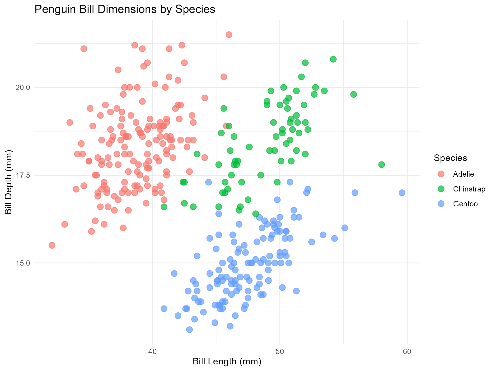
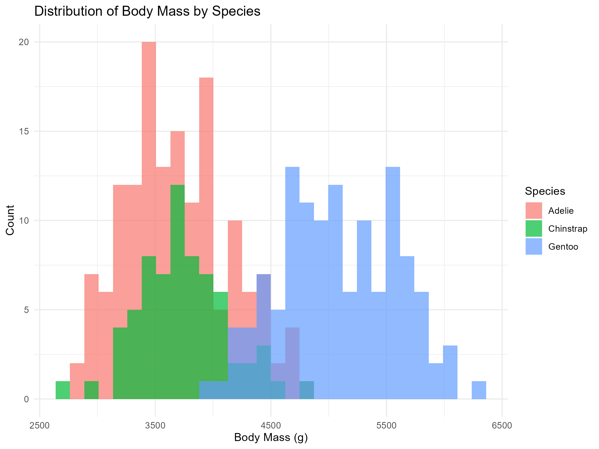
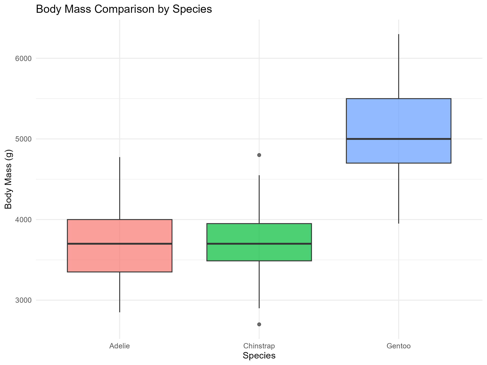

# Palmer Penguins Analysis

Detailed exploratory data analysis of penguin measurements from Palmer Station, Antarctica.

## Dataset
- **Source:** palmerpenguins R package
- **Observations:** 344 penguins
- **Species:** Adelie, Chinstrap, Gentoo

## Visualizations

### Bill Dimensions


Scatter plot showing the relationship between bill length and depth across species.

### Body Mass Distribution


Histogram displaying body mass distribution for each penguin species.

### Body Mass Comparison


Box plot comparing body mass across the three species.

## Key Findings
- Gentoo penguins are the largest species
- Strong correlation between flipper length and body mass
- Distinct bill patterns per species

## Code
See [analysis.R](analysis.R) for complete analysis code.

## How to Run
```r
install.packages(c("palmerpenguins", "ggplot2"))
source("analysis.R")
